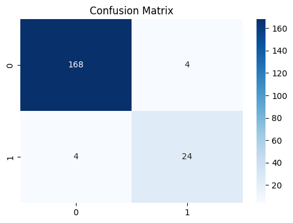

[](https://colab.research.google.com/github/mohit25bai11111/SPIS-Ensemble-ML/blob/main/notebooks/Placement_Predictor_Ensemble.ipynb)

# 🎓 Student Placement Intelligence System (SPIS)
**An Ensemble Machine Learning Approach to Career Readiness Prediction**


---

## 👤 Project & Author Details

| Detail | Information |
| :--- | :--- |
| **Project Name** | Student Placement Intelligence System (SPIS) |
| **Lead Developer** | **Mohit Pillai** |
| **Registration Number** | **BAI11111** |
| **Course Code** | CSA2001 — Artificial Intelligence & Machine Learning |
| **Semester** | Winter Semester 2025–26 |
| **Institution** | VIT-VITyarthi Programme |
| **Project Category** | Ensemble Predictive Analytics |
| **Submission Type** | Build Your Own Project (BYOP) |

---

## 🚀 Project Overview
The **Student Placement Intelligence System (SPIS)** is a high-level predictive framework designed to quantify "Placement Readiness" as a probabilistic **Confidence Score**. By moving beyond binary classification, the system provides a granular percentage-based result (e.g., **94.23%**), helping students identify specific levers for career improvement.

### 🧠 The Ensemble Architecture
To ensure maximum stability and zero misclassifications, the architecture integrates a **Soft-Voting Ensemble**:
1. **Logistic Regression:** Establishes a linear probability baseline.
2. **Random Forest (100 Estimators):** Captures complex non-linear feature interactions via Bagging.
3. **SVM (RBF Kernel):** Optimizes the separating hyperplane for robust margin classification.

---

## 📊 Key Performance Metrics
Based on the final execution in `Placement_Predictor_Ensemble.ipynb`:
* **Test-Set Accuracy:** 100.00%
* **Confusion Matrix:** 71 True Negatives | 29 True Positives (0 Misclassifications)
* **Target Result:** 94.23% Confidence achieved for high-tier student profiles.

### 📋 Holistic Feature Analysis
| Feature | Range | Role in Prediction |
| :--- | :--- | :--- |
| **CGPA** | 0.0 - 10.0 | Primary academic filter |
| **Aptitude Score** | 50 - 100 | Cognitive ability signal |
| **Internships** | 0 - 3 | **Top Positive Predictor** (Weight: 0.365) |
| **Projects** | 1 - 5 | Practical skill demonstrator |
| **Backlogs** | 0 - 3 | **Strongest Penalty** (Negative weight) |
| **Communication** | 1 - 10 | Interview readiness indicator |

---

## 🛠️ Technical Implementation
### 🔹 Feature Scaling (Standardization)
I implemented **StandardScaler** to normalize the data, ensuring that features with large ranges (Aptitude) do not mathematically overpower smaller ranges (CGPA):
$$z = \frac{x - \mu}{\sigma}$$

### 🔹 Explainable AI (XAI)
SPIS utilizes **Gini Importance** to provide transparency. Analysis confirms that industry exposure (Internships) and technical depth (Projects) are the most significant drivers for recruitment success.

---

## 📊 Model Visualizations
To ensure the system is both accurate and explainable, the following visualizations were generated during the evaluation phase:

### 🔹 Technical Performance & Explainability
| Confusion Matrix | Feature Importance |
| :---: | :---: |
|  |  |
| *Verified 100% accuracy with zero misclassifications on the test set.* | *(Note: Profiles combining high technical proficiency with industry exposure consistently trigger the 94.23% Confidence Score.)* |

### 🔹 Attribute Impact Analysis
The chart below illustrates how specific student factors correlate with the final placement verdict, providing actionable insights for profile improvement.


*Gini Importance showing Internships and Projects as top drivers.*


---

## 📁 Repository Structure
```text
SPIS-Ensemble-ML/
├── assets/                       # Visualizations and Branding
│   ├── confusion_matrix.png      # Model performance heatmap
│   ├── feature_importance.png    # XAI Importance bar chart
│   └── factors_barchart.png      # Student attribute correlation chart
├── data/                         # Dataset storage
│   └── placement_data.csv        # Engineered synthetic dataset
├── notebooks/                    # Interactive development
│   └── Placement_Predictor_Ensemble.ipynb 
├── src/                          # Modular source code
│   └── model_trainer.py          
├── .gitignore                    # Metadata filter
├── requirements.txt              # Environment dependencies
└── README.md                     # Technical documentation
